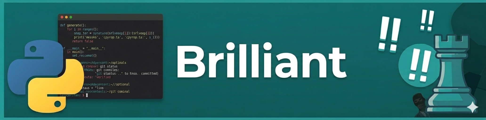

  

<h1 align="center"> Hi, I'm Grigor 👋 (@thespyhead) </h1>

<picture>
  <source media="(prefers-color-scheme: dark)" srcset="https://raw.githubusercontent.com/thespyhead/thespyhead/main/assets/brilliant-snake-dark.svg">
  <source media="(prefers-color-scheme: light)" srcset="https://raw.githubusercontent.com/thespyhead/thespyhead/main/assets/brilliant-snake.svg">
  
</picture>

<h3 align="center">Chess Player ♟️ | Python Developer 🐍</h3>

  
  <h3>🌱 I’m Currently Learning</h3>
      <h5><b>Advanced Game Hacking & Reverse Engineering</b></h5>
      
Mastering C++ and AssemblyScript to understand memory manipulation and engine internals.

  <h3>👀 I’m Interested In</h3>
      <h5><b>Artificial Intelligence & Neural Networks</b></h5>
      <h5>Exploring the boundaries of LLMs, computer vision with YOLO, and automation workflows.</h5>

---

### 🛠️ Tech Stack & Tooling

#### Languages
   
 

#### AI & Automation
 
 
 

---

<b>🚀 Click to view my Programming Journey</b>
  

 

- **Foundations:** Started with Angela Yu’s 100 Days of Code, culminating in a custom Doom-style 3D raycasting engine.
- **Web Development:** Built robust backends using Flask and interactive frontends with JS/CSS grid layouts.
- **Low-Level Mastery:** Currently diving into C++ and Assembly to bridge the gap between software and memory.

  <i>"Exploring the boundaries of what's possible, one byte at a time."</i>

